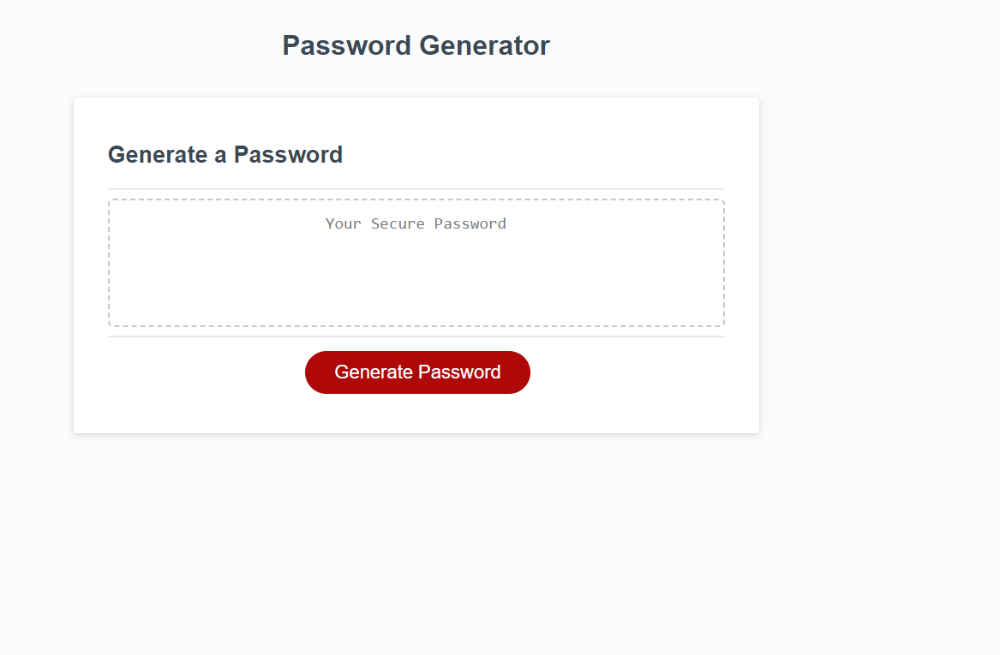

# AJ-Password-Generator
Challenge 3

This assignment is to have a system generate a password.  The user will click on the "Generate a Password" button.  Then they will be prompted 5 questions that the system will ask of what characters do they want their password to consist of.  

The questions will include: 
1: The length of the password.  Must be eight characters or more.
2. Do they want upper case
3. Do they want lower case
4. Do they want a number
5. Do they want special characters in it.

Once all questers are answered.  They system will generate a password for them.

This relieves the user from trying to come up with the password of their own.

This particular challenge, I learned how to create a function, and how to use loops.

What makes this project unique is the alert menu that pops down, where the user enters a response after each question asked.

